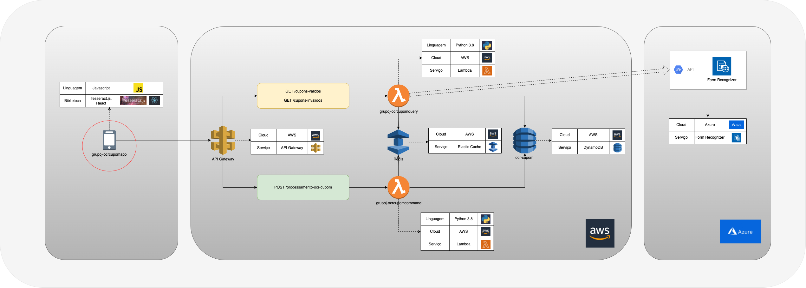
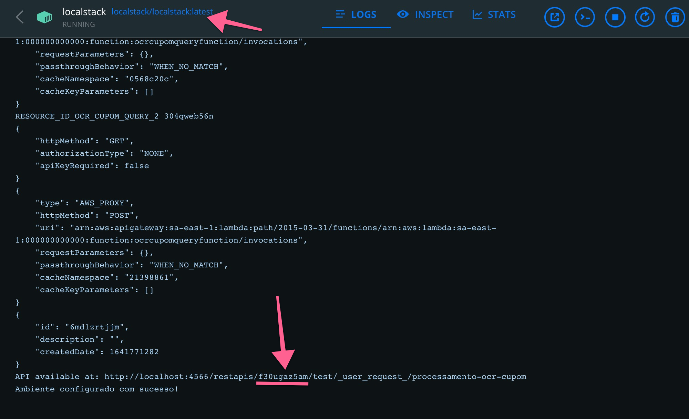
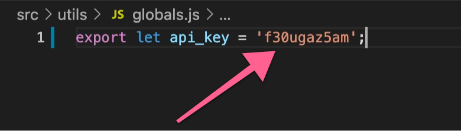

# OCR CUPOM APP

Aplicação responsável por realizar o upload do cupom, fazer uma pré validação e enviar para o processamento

## Localização na arquitetura

# Instruções para Iniciar o FrontEnd

### O Serviço do Backend precisa estar rodando antes de executar as instruções abaixo.

### Instalacao do **Node.js** é um requisito.

1. Acessar a página raiz do projeto e executar o command **'npm install'** para instalar as dependências.

2. Acessar a pagina de logs do container **localstack** e copiar o api_key.

3. Acessar o arquivo **globals.js** (src/utils/globals.js) e setar a variavel **api_key**.

4. Executar o comando **'npm start'**.

5. Acessar a URL [http://localhost:3000](http://localhost:3000) no seu navegador.
=======

